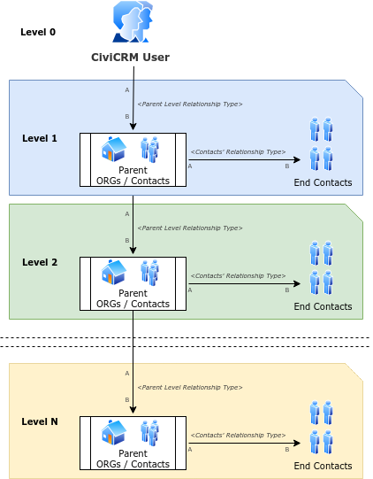
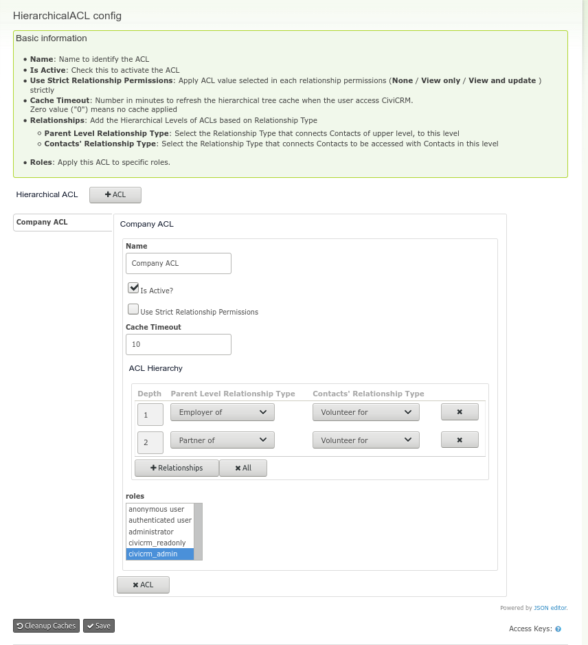

# Hierarchical ACL

This extension implements custom [ACLs](https://docs.civicrm.org/user/en/latest/initial-set-up/permissions-and-access-control/), using a Hierarchical structure based on relationships among Contacts.  
CiviCRM provides ACLs feature to restrict/grant access to view/edit contacts based on Groups, which is good, but limited for those Organizations that have a Hierarchical structure,
and their users need to have limited access only to the Contacts that are part of their inner structure.
Native CiviCRM ACLs rely on the fact that groups of Contacts (CiviCRM users) need to be created and assigned ACL to another target group of Contacts to have access to. This
is very time-consuming for Organizations that have a more complex constitution. Plus it has to be manually created, and doesn't have the option to apply *dynamic* permissions to any user based on certain conditions.  
  
In the other hand, there are some developed extensions, like [nz.co.fuzion.relatedpermissions](https://github.com/eileenmcnaughton/nz.co.fuzion.relatedpermissions), that provides permissions through relationships, but it inherits only 1-level hierarchy.  

This extension is meant to provide a *multi-level* permissions inheritance.  

A classic example would be an Organization that's structured in **Regional Sub-Organization(s)**, and then in **Local Departments** (These levels could get deeper and deeper).
In this particular example, this is a 2-level structured Organization.  
For that case, the Responsible User of the **Regional Sub-Organization(s)** must have access to all Contacts related to this plus the Contacts related to the inner Local Departments included in the **Regional Sub-Organization(s)**.  

Different use-cases are in the real world, and this extension tries to fill this gap, and make ACLs easier to use for CiviCRM operators.  

This simple chart might make easier to visualize to concept around this:  
  

**IMPORTANT:** Be aware that the direction of the relationship is very important, this extension is based in a [directed graph](https://en.wikipedia.org/wiki/Directed_graph),
which in CiviCRM means that the Contact A is the origin of the relationship and Contact B is the end of it (in the chart shown as the arrow among Contacts).  

## Fundamentals

The main foundations of **Hierarchical ACLs** are **Relationships Types**. The objective is to be able to setup a *Contact Structure tree* based on relationship types
to apply to any logged in user that have no permissions of **view/edit all contacts** (in this case the ACL is not applicable).

Let's think in the example described below:
- The **Organization X** is divided in **Regional Sub-Organizations** per Countries. And then every **Regional Sub-Organizations** is divided again in **Local Departments**
per Country's region. The **Local Departments** are assigned to each **Regional Sub-Organizations** with a Relationship of type **Is Local Department of**.
- Constituents of **Organization X** (any type of Contact) belongs to one **Local Department Organization**. They are assigned to each Department with a Relationship of type **Is Member of**.
- There are CiviCRM Users that are Responsible of **Regional Sub-Organizations**, and they are assigned to each of those Organization with a Relationship of type **Is Responsible of**.

So **Organization X** wants that every Responsible User can have access only to all Constituents that are part of the **Local Departments** belonging to its **Regional Sub-Organizations**.  

Implementing this use-case with CiviCRM native ACLs is almost impossible or too time-consuming if you do the maths on how many Groups and ACLs need to be manually created. But not for **Hierarchical ACL**.  

*More docs and examples coming up soon..!*  

## Requirements

* PHP v7.2+
* CiviCRM 5.27+

## Installation

Follow any method of your choice to install it. More info [here](https://docs.civicrm.org/user/en/latest/introduction/extensions/#installing-extensions)

## Usage

1. Install the extension
2. Visit *Administer / Users and Permissions / Hierarchical ACL Configuration*
3. Here you can setup the **Hierarchical ACLs** where:
- **Name:** Name to identify the ACL
- **Is Active:** Check this to activate the ACL
- **Use Strict Relationship Permissions:** Apply ACL value selected in each relationship permissions (*None / View only / View and update* ) strictly
- **Cache Timeout:** Number in minutes to refresh the hierarchical tree cache when the user access CiviCRM. Zero value ("0") means no cache applied
- **Relationships:** Add the Hierarchical Levels of ACLs based on Relationship Type
  - **Parent Level Relationship Type:** Select the Relationship Type that connects Contacts of upper level, to this level
  - **Contacts' Relationship Type:** Select the Relationship Type that connects Contacts to be accessed with Contacts in this level
- **Roles:** Apply this ACL to specific roles.

## Known Issues

- The current implementation could be arguable regarding web site performance impact, and any suggestion to improve it will be more than welcome :)

## Support and Maintenance

This extension is supported and maintained by:  

  

The extension is licensed under [AGPL-3.0](LICENSE.txt).  
